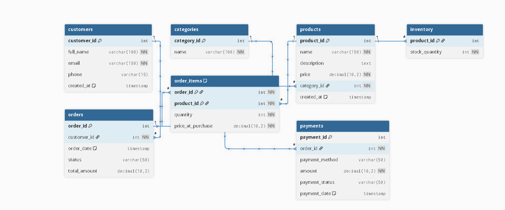
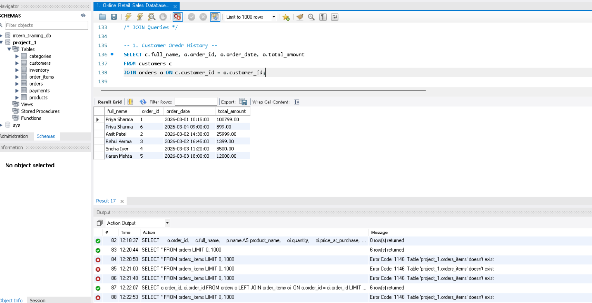
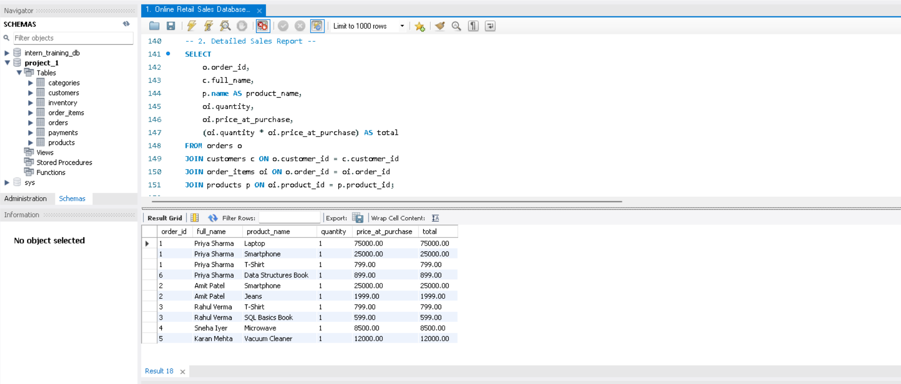
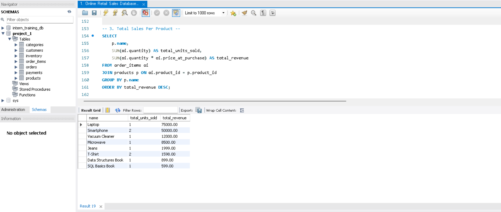
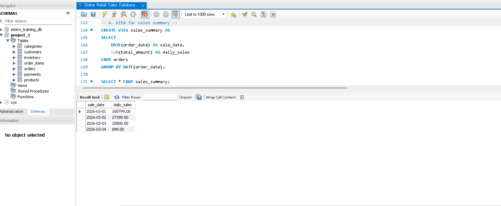

# 🛒 Online Retail Sales Database Design

## 📌 Project Overview

This project involves designing and implementing a fully normalized relational database schema for an Online Retail (E-Commerce) platform using SQL MySQL.

The objective is to model real-world e-commerce operations such as customer management, product cataloging, order processing, payment handling, and sales reporting using proper database design principles.

This project demonstrates:

- Database normalization (up to 3NF)
- Entity-Relationship modeling
- Constraint management
- Referential integrity
- Sales reporting using JOIN queries
- View creation for business insights

---

## 🎯 Objectives

- Identify core business entities for an online retail system
- Design an ER Diagram using dbdiagram.io
- Normalize schema to Third Normal Form (3NF)
- Implement SQL DDL scripts with proper constraints
- Populate tables with realistic sample data
- Write JOIN queries for business-level reports
- Create views for summarized sales reporting

---

## 🧠 System Design Approach

The schema is designed following real-world production-level database principles.

### Core Entities

- Customers
- Products
- Categories
- Orders
- Order_Items (Junction Table)
- Payments
- Inventory

### Key Design Decisions

- Many-to-Many relationship between Orders and Products handled using `Order_Items`
- Historical pricing preserved using `price_at_purchase`
- Inventory managed separately for scalability
- Referential integrity enforced using Foreign Keys
- Data validation ensured using CHECK, UNIQUE, and NOT NULL constraints

---

## 🏗 Entity Relationship Model

The ER diagram includes:

- Primary Keys (PK)
- Foreign Keys (FK)
- One-to-Many relationships
- Many-to-Many relationship via junction table
- Constraint definitions

> ER Diagram created using **dbdiagram.io**

### ER-diagram

---

## 📸 Screen-Shots

### 1️⃣ Customer order history

### 2️⃣ Detailed Sales Report

### 3️⃣ Total Sales per Product

### 4️⃣ VIEW for sales summary

---

## 🗃 Database Schema

The schema includes:

- Primary Keys
- Foreign Key Constraints
- Composite Keys (Order_Items)
- CHECK Constraints
- UNIQUE Constraints
- ON DELETE rules
- Indexed columns for performance optimization

SQL DDL script included in:

---

## 📥 Sample Data

The database is populated with realistic sample records for:

- Customers
- Categories
- Products
- Inventory
- Orders
- Order_Items
- Payments

Sample data script available in:

---

## 📊 Reporting Queries

The project includes advanced SQL queries for:

- Customer order history
- Detailed order breakdown reports
- Total sales per product
- Revenue aggregation
- Daily sales summary
- Payment tracking

Query file:

---

## 👁 Sales Summary View

A database view `sales_summary` is created to provide daily aggregated sales insights for reporting and analytics teams.

---

## ⚙ Technologies Used

- SQL (PostgreSQL / MySQL)
- dbdiagram.io (ER Modeling)
- Relational Database Design Principles

---

## 🔍 Normalization

The database schema is normalized up to **Third Normal Form (3NF)**:

- 1NF → Atomic values, no repeating groups
- 2NF → No partial dependency on composite keys
- 3NF → No transitive dependency between non-key attributes

---

## 🚀 Performance Considerations

- Indexes created on foreign key columns
- Composite primary keys used where necessary
- Avoided redundant data storage
- Designed schema for scalability and maintainability

---

## 📌 Deliverables

- ER Diagram (PNG or PDF)
- Normalized SQL Schema (DDL Script)
- Sample Data Script
- Business Reporting Queries
- Sales Summary View
- Documentation (README)

---

## 🎓 Learning Outcomes

Through this project, the following database skills are demonstrated:

- Advanced SQL schema design
- Handling complex relationships
- Writing multi-table JOIN queries
- Applying normalization principles
- Designing scalable relational systems
- Implementing business-level reporting

---

## 📈 Future Enhancements

- Order status history tracking
- Trigger for automatic inventory deduction
- Stored procedures for order processing
- Transaction management for consistency
- Partitioning for large-scale datasets
- Role-based access control

---

## 👨‍💻 Author

Developed as part of internship database design assignment.